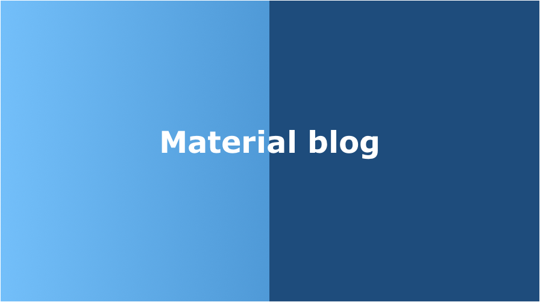

[](LICENSE)
[](https://circleci.com/gh/Takumon/mean-blog/tree/master)
[](https://codeclimate.com/github/Takumon/mean-blog/maintainability)

※ 開発者の方は[開発者向けREADME](./README.dev.md)を参照してください。本アプリのフォルダ構成やCIの方法を記載しています。

##  チームでナレッジ共有&蓄積するためのブログアプリ
* イントラでの利用を想定
  * Dockerで簡単インストール
* Markdown入力補助機能付き！プレーンテキスト形式でも書ける!
  * Markdownへの壁を低くしてMarkdownで書く文化を浸透させられる
  * Markdownを知らなくてもリストやテーブルなどが簡単に入力できる
* 記事に対してコメントがしやすい!いいね機能も付いている!

## License
MIT

## デモ環境
https://material-blog-demo.herokuapp.com/
  * ユーザID/パスは `DemoUser` / `DemoUser1234#`

## インストール方法
* docker-compose.yml作成

```
version: "3.3"
services:
  web:
    image: takumon/mean-blog_auto
    ports:
      - 3000:3000
    depends_on:
      - mongo
    links:
      - mongo
    environment:
      MONGO_URL: mongodb://mongo:27017/test
  mongo:
    image: mongo:3.5.12
    ports:
      - 27017:27017
    volumes:
      - ./db:/data/db
  db-viewer:
    image: mongo-express:latest
    ports:
     - 8082:8081
    depends_on:
      - mongo
    links:
     - mongo
```

* コンテナを起動

```
$ docker-compose up -d
```

* ブラウザで`http://localhost:3000`にアクセス

## 構成
* クライアント(フレームワーク) ・・・ Angular v6
* クライアント(UIライブラリ) ・・・ Angular Material v6
* サーバ ・・・ Express v4
* 実行環境 ・・・Node v8
* DB ・・・ MongoDB v3
